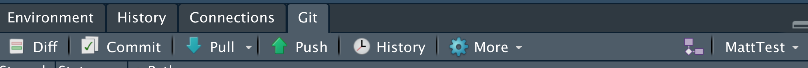
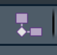
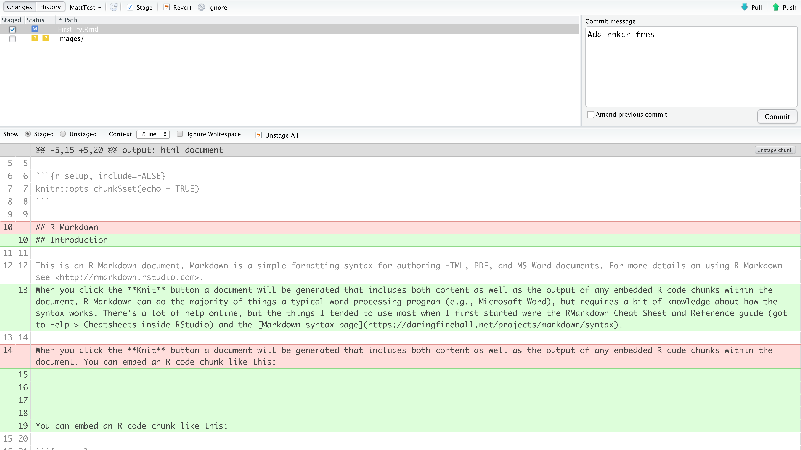
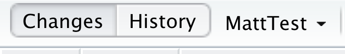

# Introduction to Rmarkdown
_based on the discussion on 5 Nov 2019, Jenny Bryan's [happygitwithr](https://happygitwithr.com/), and the [Data Analysis and Visualization](https://gge-ucd.github.io/R-DAVIS/index.html) course hosted by students at the University of California, Davis_

## "Gitting" started
1. _Clone this repository into RStudio_
    - Open RStudio
    - Go to File>New Project and choose the "Version Control" option
    - Select "Git" (Not Subversion)
    - paste the link from the "Clone Repository" button into the "Repository URL" space

This should create a folder on your computer with this file (README.md) and the Rmarkdown document we'll be working using for this example (FirstTry.Rmd).

2. Make sure you're up-to-date

  - Go to the "Git" tab in Rstudio (mine shows up in the same window as Environment, History, etc)
 
  
  - Click the "Pull" button to make sure you've cloned the most recent version
  
3. Open FirstTry.Rmd

4. Create a local branch (or fork) of the repository by clicking on the fork  button
5. Make your changes based on what was assigned to you in the Issue. Be careful to make your changes in the location where they are identified in the document.
6. Save your file (still as FirstTry.Rmd). This will place the file with a tickbox next to it in your "Git" screen. Select the tickbox next to FirstTry.Rmd and push the commit button. That should open a screen that looks like this 

note the name of my local branch in the top left corner - if this still say 'master' don't commit! you haven't switched to your local branch

7. Click the "Push" button to send your commits to the remote location on Github

8. Go to the "Pull Request tab" and click "new pull request". Leave the "base:" set to master and change the "compare:" to the name of your branch. Click "Create Pull Request". Enter a message describing the changes you made and issue the pull request. I'll show you what happens next when we're in class together!
